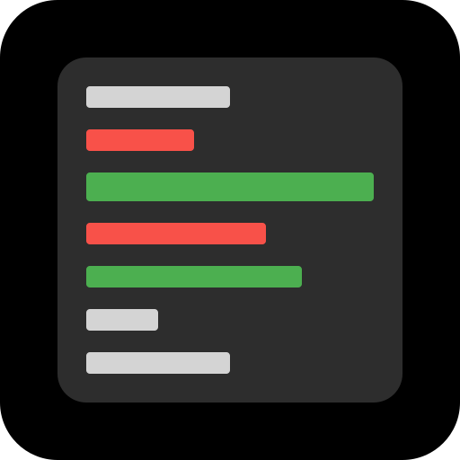

#  Code Review Practice Application 

An application for practicing code reviews with a focus on security vulnerabilities.

## Description

This Electron application provides a platform for users to practice identifying security vulnerabilities in code snippets. It loads code examples and allows users to review them.

## Prerequisites

*   [Node.js](https://nodejs.org/) (which includes npm)

## Setup

1.  Clone the repository or download the source code.
2.  Navigate to the project directory in your terminal.
3.  Install the dependencies:
    ```bash
    npm install
    ```

## Running the Application

To run the application in development mode:

```bash
npm start
```

*Note: The `start` script includes `LIBGL_ALWAYS_SOFTWARE=1` to force software rendering, which may help avoid certain graphics driver issues on some systems.*

## Building the Application

To build the application for your platform (Windows portable, Linux AppImage):

```bash
npm run build
```

The built application will be located in the `dist` directory.

## Future Scope

*   **AI-Powered Evaluation:** Implement functionality to evaluate user-submitted answers using AI.
*   **AI Code Generation:** Integrate AI to generate new code samples for review.

## Adding New Problems

To add new vulnerability examples:

1.  Use an AI assistant like ChatGPT to generate code snippets demonstrating specific vulnerabilities.
2.  Format these examples according to the JSON structure found in `codes/vulnerabilities.json`.
3.  Add the new JSON objects to the `vulnerabilities.json` file.